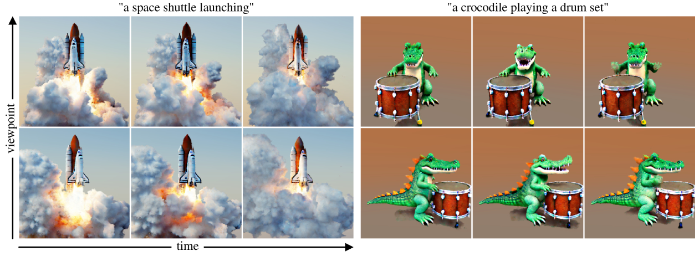
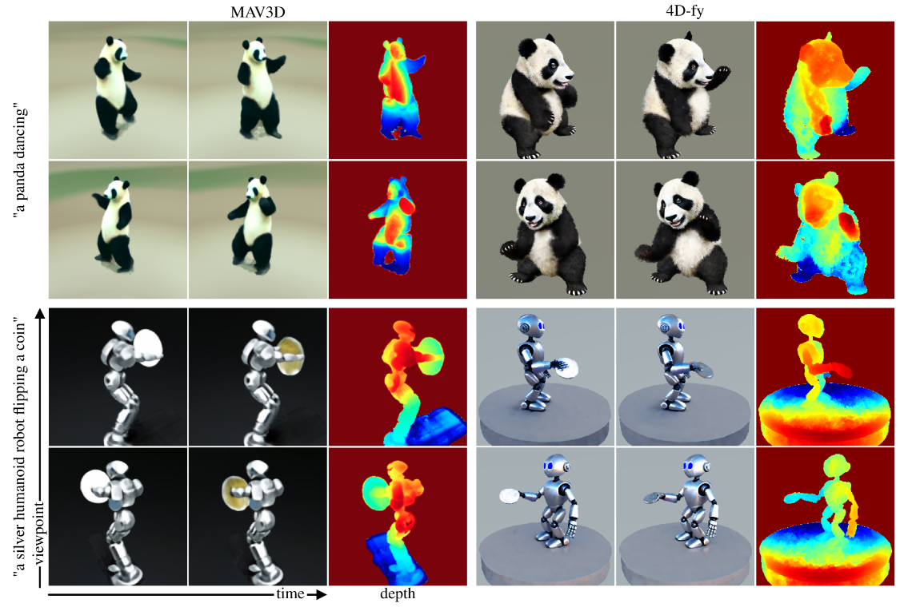

# 4D-fy: Text-to-4D Generation Using Hybrid Score Distillation Sampling

Update: 2023/12/25

## ℹ️ Info
- Paper: [arxiv.org](https://arxiv.org/abs/2311.17984)
  - Submission date: 2023/11/29
  - Authors: Sherwin Bahmani, Ivan Skorokhodov, Victor Rong, Gordon Wetzstein, Leonidas Guibas, Peter Wonka, Sergey Tulyakov, Jeong Joon Park, Andrea Tagliasacchi, David B. Lindell
  - Conf.: ??
  - HTML: [ar5iv.labs.arxiv.org](https://ar5iv.labs.arxiv.org/html/2311.17984)
- Implementation: [sherwinbahmani/4dfy](https://github.com/sherwinbahmani/4dfy)
  - framework: Pytorch
  - Official code: Yes
  - License: Apache License 2.0
- Keywords: CV

## 🖥️ Setup commands to run the implementation
- Test env.: GPU: RTX2080Ti

### 1. Clone the repository and move to the directory
```bash
git clone https://github.com/Obarads/OGIex.git
cd OGIex/scripts/4dfy
```

### 2. Run the implementation 
Please refer to `OGIex/scripts/4dfy/README.md` (or the [README.md on Github](https://github.com/Obarads/OGIex/tree/main/scripts/4dfy/README.md)).

## 📝 Clipping and note
### Introduction
- > Here, we propose a method for text-to-4D scene generation that alleviates this three-way tradeoff using hybrid SDS, an alternating optimization scheme that blends gradient updates from multiple pre-trained diffusion models and synthesizes 4D scenes using the best qualities of each.
- Fig.1 shows scenes.


> Figure 1:Text-to-4D Synthesis. We present 4D-fy, a technique that synthesizes 4D (i.e., dynamic 3D) scenes from a text prompt. We show scenes generated from two text prompts for different viewpoints (vertical dimension) at different time steps (horizontal dimension). Video results can be viewed on our website: https://sherwinbahmani.github.io/4dfy


### Contributions, novelty
> Overall we provide the following contributions.
> - We introduce hybrid SDS, a technique that extracts desirable qualities from multiple pre-trained diffusion models and alleviates a tradeoff between appearance, 3D structure, and motion in text-to-4D scene generation.
> - We provide a quantitative and qualitative evaluation of the method, and we explore the three-way tradeoff space with ablation studies to facilitate future research.
> - We demonstrate text-to-4D generation based on open-source pretrained models and will make all codes and evaluation procedures publicly available.
> - We present state-of-the-art results for the task of text-to-4D generation.

### Result
- > We visualize spatio-temporal renderings along with depth maps in comparison to MAV3D in Fig. 4.
  - > Although both methods can synthesize 4D scenes, MAV3D noticeably lacks detail.
  - > In contrast, our method produces realistic renderings across space and time.



### Other experiments
Quantitative results, Ablations

## 📚 References
- [] 

