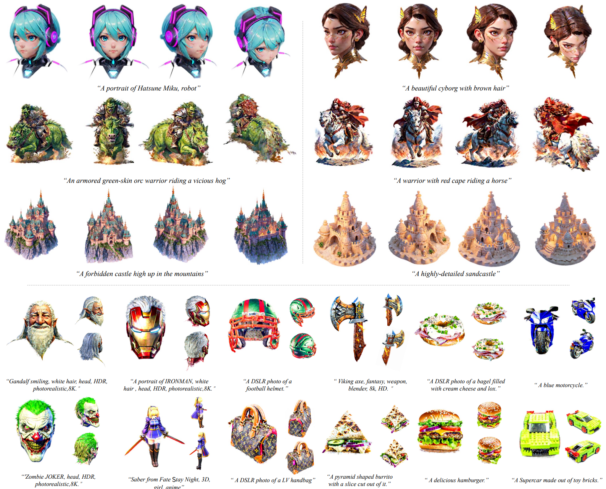
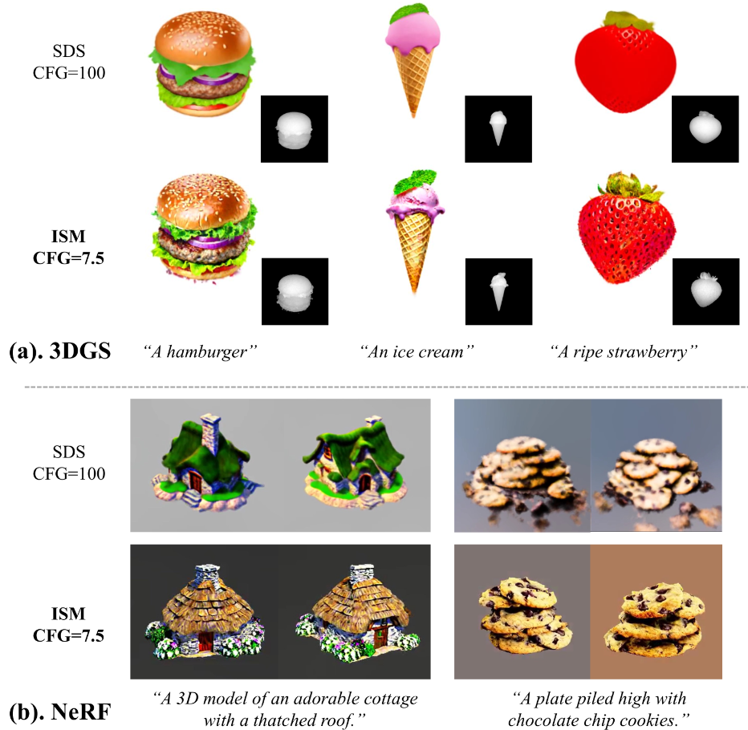

# LucidDreamer: Towards High-Fidelity Text-to-3D Generation via Interval Score Matching

Update: 2023/12/24

## ℹ️ Info
- Paper: [arxiv.org](https://arxiv.org/abs/2311.11284)
  - Submission date: 2023/11/19
  - Authors: Yixun Liang, Xin Yang, Jiantao Lin, Haodong Li, Xiaogang Xu, Yingcong Chen
  - Conf.: ??
  - HTML: [ar5iv.labs.arxiv.org](https://ar5iv.labs.arxiv.org/html/2311.11284)
- Implementation: [EnVision-Research/LucidDreamer](https://github.com/EnVision-Research/LucidDreamer)
  - framework: Pytorch
  - Official code: Yes
  - License: MIT License

- Keywords: CV

## 🖥️ Setup commands to run the implementation
- Test env.: GPU: RTX4090

### 1. Clone the repository and move to the directory
```bash
git clone https://github.com/Obarads/OGIex.git
cd OGIex/scripts/LucidDreamer
```

### 2. Run the implementation 
Please refer to `OGIex/scripts/LucidDreamer/README.md` (or the [README.md on Github](https://github.com/Obarads/OGIex/tree/main/scripts/LucidDreamer/README.md)).


## 📝 Clipping and note
### Introduction
- > This paper identifies a notable deficiency in SDS, that it brings inconsistent and low-quality updating direction for the 3D model, causing the over-smoothing effect. 
  - > To address this, we propose a novel approach called Interval Score Matching (ISM).
- > Furthermore, we incorporate 3D Gaussian Splatting into our text-to-3D generation pipeline.

### Contributions, novelty
> Overall, our contributions can be summarized as follows.
> - We provide an in-depth analysis of Score Distillation Sampling (SDS), the fundamental component in text-to-3D generation, and identify its key limitations for providing inconsistent and low-quality pseudo-GTs. This provides an explanation of the over-smoothing effect that exists in many approaches.
> - In response to SDS’s limitations, we propose the Interval Score Matching (ISM). With invertible diffusion trajectories and interval-based matching, ISM significantly outperforms SDS with highly realistic and detailed results.
> - By integrating with 3D Gaussian Splatting, our model achieves state-of-the-art performance, surpassing existing methods with less training costs.

### Result
- Text-to-3D Generation
  - > We show the generated results of LucidDreamer in Fig. 1 with original stable diffusion [38] (below the dashed line) and various fintune checkpoints [27, 53, 1]1 (above the dashed line).
- Generalizability of ISM.
  - > To evaluate the generalizability of ISM, we conduct a comparison with ISM and SDS in both explicit representation (3DGS [20]) and implicit representation (NeRF [32]).
  - > Notably, we follow the hyperparameter design of ProlificDreamer in the NeRF comparison. 
  - > As shown in Fig 5, our ISM provides fined-grained details even with normal CFG (7.5) in both NeRF [32] and 3D Gaussian Splatting [20] (3DGS), which is significantly better than the SDS.


> Figure 1:Examples of text-to-3D content creations with our framework. We present a text-to-3D generation framework, named the LucidDreamer, to distill high-fidelity textures and shapes from pretrained 2D diffusion models (detailed shows on Sec. 4) with a novel Interval Score Matching objective and an Advanced 3D distillation pipeline. Together, we achieve superior 3D generation results with photorealistic quality in a short training time. Please zoom in for details.


> Figure 5:A comparison of SDS [34] and ISM with different 3D models. It shows that either using (a). 3DGS or (b). NeRF, the results of SDS tend to be smooth, whereas our ISM excels in distilling more realistic content and is rich in detail. Please zoom in for details.

### Other experiments
Qualitative Comparison, User study, Ablation Studies.

## 📚 References
- [] 

