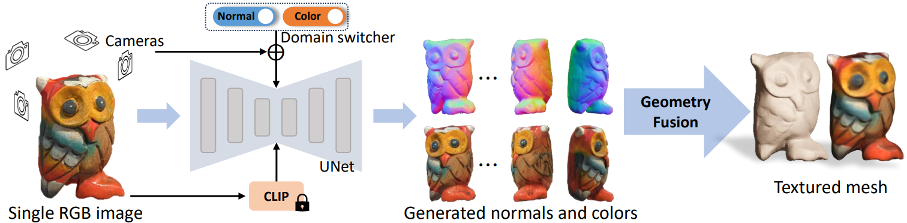
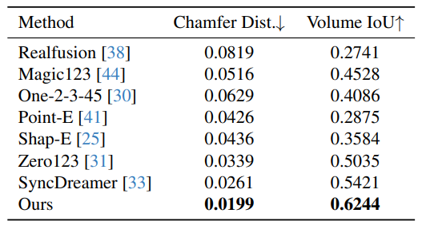
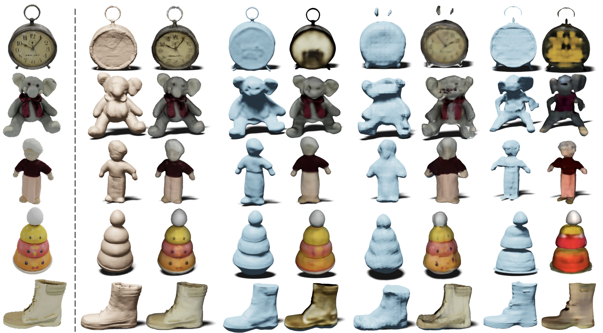
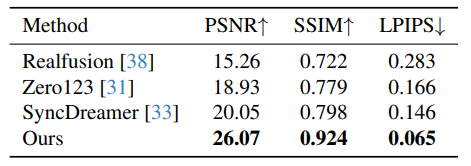
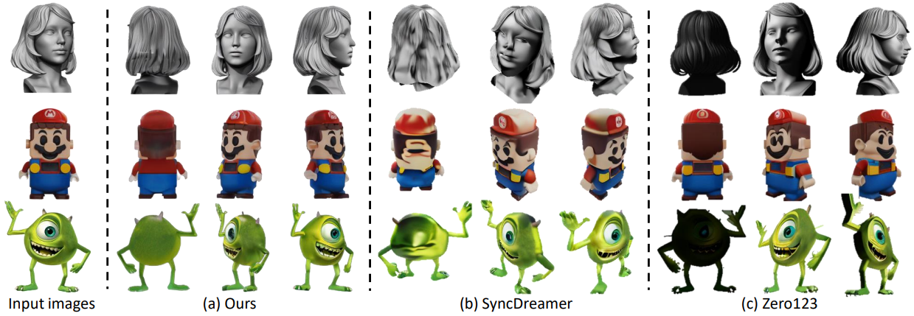

# Wonder3D: Single Image to 3D using Cross-Domain Diffusion

Update: 2024/01/11

## ℹ️ Info
- Paper: [arxiv.org](https://arxiv.org/abs/2310.15008)
  - Submission date: 2023/10/23
  - Authors: Xiaoxiao Long, Yuan-Chen Guo, Cheng Lin, Yuan Liu, Zhiyang Dou, Lingjie Liu, Yuexin Ma, Song-Hai Zhang, Marc Habermann, Christian Theobalt, Wenping Wang
  - Conf.: ??
  - HTML: [ar5iv.labs.arxiv.org](https://ar5iv.labs.arxiv.org/html/2310.15008)
- Implementation: [xxlong0/Wonder3D](https://github.com/xxlong0/Wonder3D)
  - framework: Pytorch
  - Official code: Yes
  - License: MIT License
- Keywords: CV

## 🖥️ Setup commands to run the implementation
- Test env.: GPU: RTX2080Ti

### 1. Clone the repository and move to the directory
```bash
git clone https://github.com/Obarads/OGIex.git
cd OGIex/scripts/Wonder3D
```

### 2. Run the implementation 
Please refer to `OGIex/scripts/Wonder3D/README.md` (or the [README.md on Github](https://github.com/Obarads/OGIex/tree/main/scripts/Wonder3D/README.md)).

## 📝 Clipping and note
### Introduction
- > In this work, we introduce Wonder3D, a novel method for efficiently generating high-fidelity textured meshes from single-view images.
- > To holistically improve the quality, consistency, and efficiency of single-view reconstruction tasks, we propose a cross-domain diffusion model that generates multi-view normal maps and the corresponding color images.
- > Lastly, we introduce a geometry-aware normal fusion algorithm that extracts high-quality surfaces from the multi-view 2D representations.
- Fig. 2 is overview of Wonder3D.


> Figure 2. Overview of Wonder3D. Given a single image, Wonder3D takes the input image, the text embedding produced by CLIP model [45], the camera parameters of multiple views, and a domain switcher as conditioning to generate consistent multi-view normal maps and color images. Subsequently, Wonder3D employs an innovative normal fusion algorithm to robustly reconstruct high-quality 3D geometry from the 2D representations, yielding high-fidelity textured meshes.

### Contributions, novelty
> Wonder3D possesses several distinctive properties and accordingly has the following contributions:
> - Wonder3D holistically considers the issues of generation quality, efficiency, generalizability, and consistency for single-view 3D reconstruction. It has achieved a leading level of geometric details with reasonably good efficiency among current zero-shot single-view reconstruction methods.
> - We propose a new multi-view cross-domain 2D diffusion model to predict normal maps and color images. This representation not only adapts to the original data distribution of Stable Diffusion model but also effectively captures the rich surface details of the target shape.
> - We propose a cross-domain attention mechanism to produce multi-view normal maps and color images that are consistently aligned. This mechanism facilitates information perception across different domains, enabling our method to recover high-fidelity geometry.
> - We introduce a novel geometry-aware normal fusion algorithm that can robustly extract surfaces from the generated normal maps and color images.

### Result
- > Single View Reconstruction
  - > We evaluate the quality of the reconstructed geometry of different methods. The quantitative results are summarized in Table 1, and the qualitative comparisons are presented in Fig. 6.
- > Novel View Synthesis
  - > We evaluate the quality of novel view synthesis for different methods. The quantitative results are presented in Table 2, and the qualitative results can be found in Figure 3.


> Table 1. Quantitative comparison with baseline methods. We report Chamfer Distance and Volume IoU on the GSO [13] dataset.


> Figure 6. The qualitative comparisons with baseline methods on GSO [13] dataset in terms of the reconstructed textured meshes.


> Table 2. The quantitative comparison in novel view synthesis. We report PSNR, SSIM [62], LPIPS [74] on the GSO [13] dataset.


> Figure 3. The qualitative comparisons with baseline models on synthesized multi-view color images.

### Other experiments
Discussions

## 📚 References
- [] 


