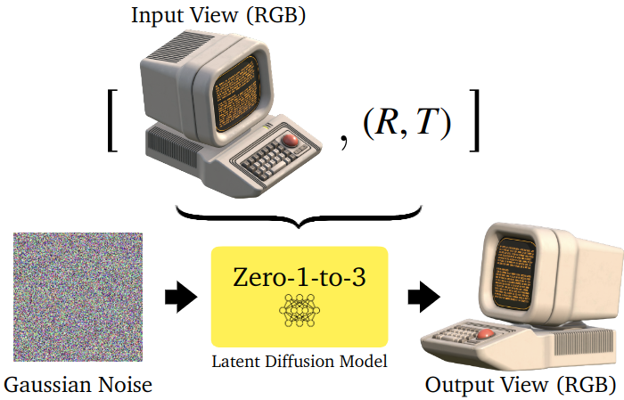
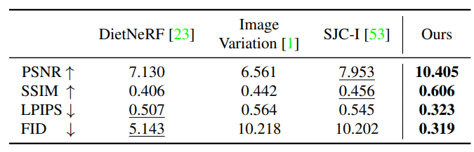
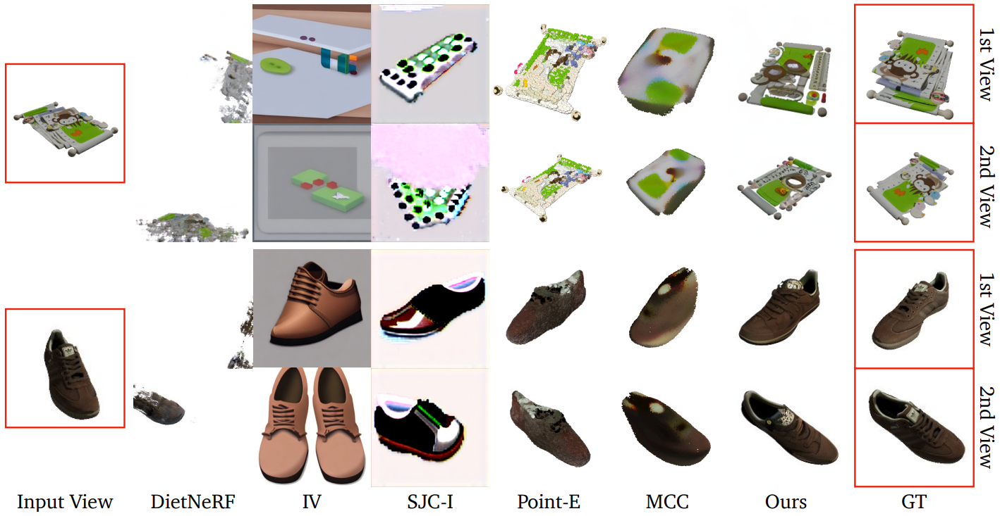
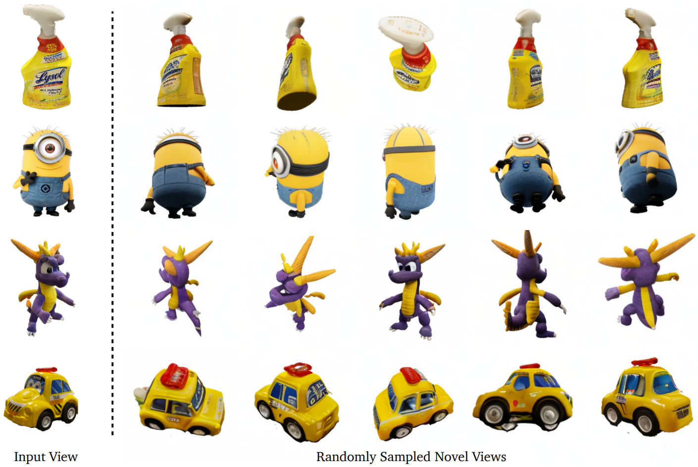
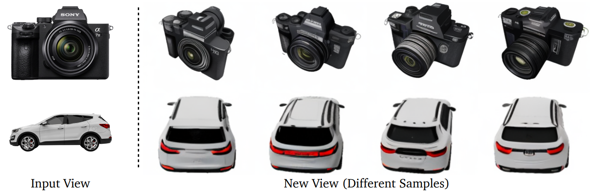

# Zero-1-to-3: Zero-shot One Image to 3D Object

Update: 2024/01/21

## ℹ️ Info
- Paper: [arxiv.org](https://arxiv.org/abs/2303.11328)
  - Submission date: 2023/03/20
  - Authors: Ruoshi Liu, Rundi Wu, Basile Van Hoorick, Pavel Tokmakov, Sergey Zakharov, Carl Vondrick
  - Conf.: ??
  - HTML: [ar5iv.labs.arxiv.org](https://ar5iv.labs.arxiv.org/html/2303.11328)
- Implementation: [cvlab-columbia/zero123](https://github.com/cvlab-columbia/zero123)
  - framework: Pytorch
  - Official code: Yes
  - License: MIT License
- Keywords: CV

## 🖥️ Setup commands to run the implementation
- Test env.: GPU: RTX4090

### 1. Clone the repository and move to the directory
```bash
git clone https://github.com/Obarads/OGIex.git
cd OGIex/scripts/zero123
```

### 2. Run the implementation 
Please refer to `OGIex/scripts/zero123/README.md` (or the [README.md on Github](https://github.com/Obarads/OGIex/tree/main/scripts/zero123/README.md)).

## 📝 Clipping and note
### Introduction
- > In this paper, we demonstrate that we are able to learn control mechanisms that manipulate the camera viewpoint in large-scale diffusion models, such as Stable Diffusion [44], in order to perform zero-shot novel view synthesis and 3D shape reconstruction.
- Fig.3 shows overview of Zero 1-to-3.


> Figure 3: Zero-1-to-3 is a viewpoint-conditioned image translation model using a conditional latent diffusion architecture. Both the input view and a relative viewpoint trans- formation are used as conditional information.

### Contributions, novelty
- > The primary contribution of this paper is to demonstrate that large diffusion models have learned rich 3D priors about the visual world, even though they are only trained on 2D images.
- > We also demonstrate state-of-the-art results for novel view synthesis and state-of-the-art results for zero-shot 3D reconstruction of objects, both from a single RGB image.

### Result
- Novel View Synthesis Results
  - > We show the numerical results in Tables 1 and 2. Figure 5 shows that our method, as compared to all baselines on GSO, is able to generate highly photorealistic images that are closely consistent with the ground truth.
  - > Such a trend can also be found on RTMV in Figure 6, even though the scenes are out-of-distribution compared to the Objaverse dataset.
  - > In Figure 7, we further demonstrate the generalization performance of our model to objects with challenging geometry and texture as well as its ability to synthesize high-fidelity viewpoints while maintaining the object type, identity and low-level details.
  - > Figure 8 exemplifies the diversity of plausible, high-quality images sampled from novel viewpoint.


> Table 1: Results for novel view synthesis on Google Scanned Objects. All metrics demonstrate that our method is able to outperform the baselines by a significant margin.


> Table 2: Results for novel view synthesis on RTMV. Scenes in RTMV are out-of-distribution from Objaverse training data, yet our model still outperforms the baselines by a significant margin.


> Novel view synthesis on Google Scanned Objects [10]. The input view shown on the left is used to synthesize two randomly sampled novel views. Corresponding ground truth views are shown on the right. Compared to the baselines, our synthesized novel view contain rich textual and geometric details that are highly consistent with the ground truth, while baseline methods display a significant loss of high-frequency details.


> Figure 7: Novel view synthesis on in-the-wild images. The 1st, 3rd, and 4th rows show results on images taken by an iPhone, and the 2nd row shows results on an image downloaded from the Internet. Our method works are robust to objects with different surface materials and geometry. We randomly sampled 5 different viewpoints and directly showcase the results without cherry-picking. We include more uncurated results in the supplementary materials.


> Figure 8: Diversity of novel view synthesis. With an input view, we fix another viewpoint and randomly generate multiple conditional samples. The different results reflect a range of diversity in terms of both geometry and appearance information that is missing in the input view.

### Other experiments
3D Reconstruction Results, Text to Image to 3D, etc.

## 📚 References
- [] 
